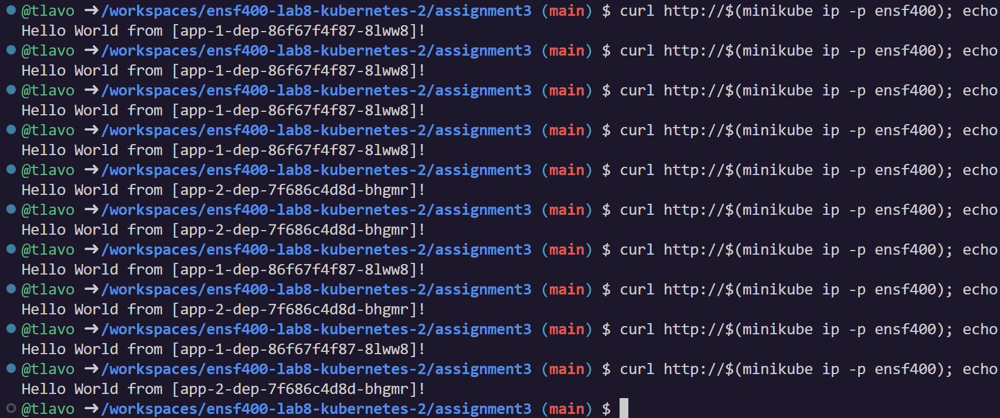

# ENSF400 - A3 - Kubernetes - How to run & Output
**Teresa Lavoie**

## How to run
Initially you should be within the ``assignment3`` directory. If you are not just cd into it as usual:

```bash
cd ./assignment3
```    
Now start minikube (with profile):
```bash
minikube start -p ensf400
```
Next make sure that the Ingress addon is enabled for the minikube profile:
```bash
minikube addons enable ingress -p ensf400
```
You can apply the yaml deployment files and such individually, but for convenience just use this command:
```bash
kubectl apply -f .
```
Finally, to run the application run the following curl command (the ``echo`` is just for better formatting):
```bash
curl http://$(minikube ip -p ensf400); echo
```

## Output
**Here is what the output should look like:**


### How requirements are met
- <ins>Deployment:</ins> The ``nginx-dep.yaml`` file defines a Deployment named ``nginx-dep`` with 5 replicas, using the NGINX image ``nginx:1.14.2``, and exposing port 80
- <ins>ConfigMap:</ins> The ``nginx-configmap.yaml`` file defines a ConfigMap named ``nginx-configmap`` containing the required configuration for the NGINX load balancer
- <ins>Mounting Configuration File:</ins> The Deployment ``nginx-dep`` mounts the ``default.conf`` configuration file to the correct path (``/etc/nginx/nginx.conf``)
- <ins>Service:</ins> The ``nginx-svc.yaml`` file defines a Service named ``nginx-svc``, exposing port 80 and using label selectors to select pods from the ``nginx-dep`` Deployment
- <ins>Ingress:</ins> The ``nginx-ingress.yaml`` file defines an Ingress named ``nginx-ingress``, redirecting requests to path ``/`` to the backend service ``nginx-svc``
- <ins>Application Deployments:</ins> The files ``app-1-dep.yaml`` and ``app-2-dep.yaml`` define Deployments for ``app-1`` and ``app-2``
- <ins>Ingress for App-1 and App-2:</ins> The files ``app-1-ingress.yaml`` and ``app-2-ingress.yaml`` define Ingresses for ``app-1`` and ``app-2``, redirecting requests to the respective backend apps and handling canary deployment traffic as specified
- <ins>Traffic Splitting:</ins> The Ingress configurations ``app-1-ingress.yaml`` and ``app-2-ingress.yaml`` are designed to split traffic between ``app-1`` and ``app-2`` deployments (the ``app-1-ingress.yaml`` redirects 70% of the traffic to ``app-1`` while ``app-2-ingress.yaml`` redirects 30% of the traffic to ``app-2`` using canary deployment)